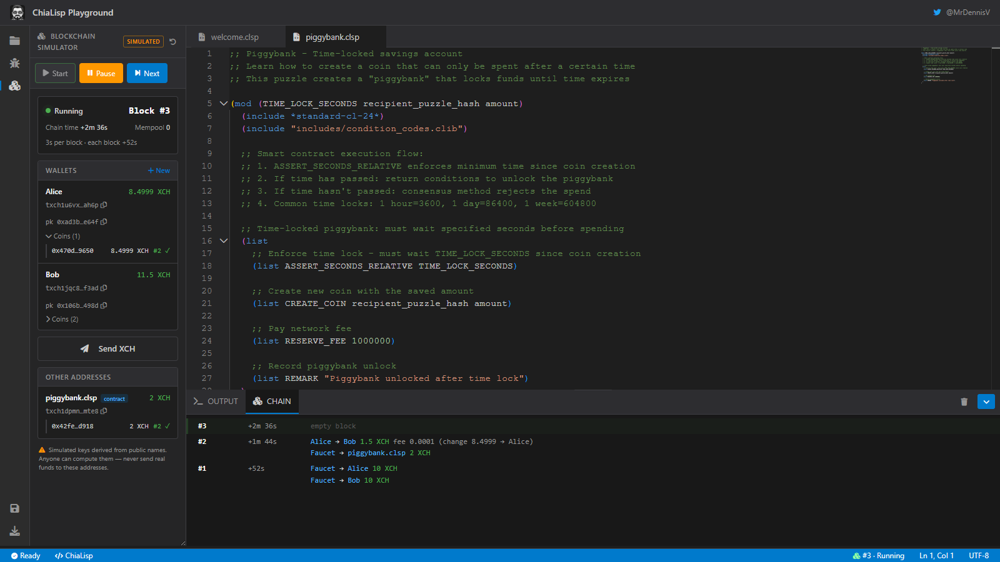
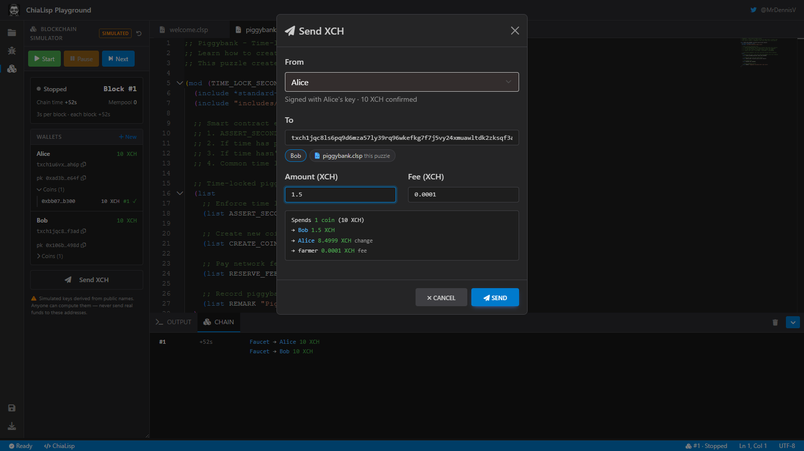
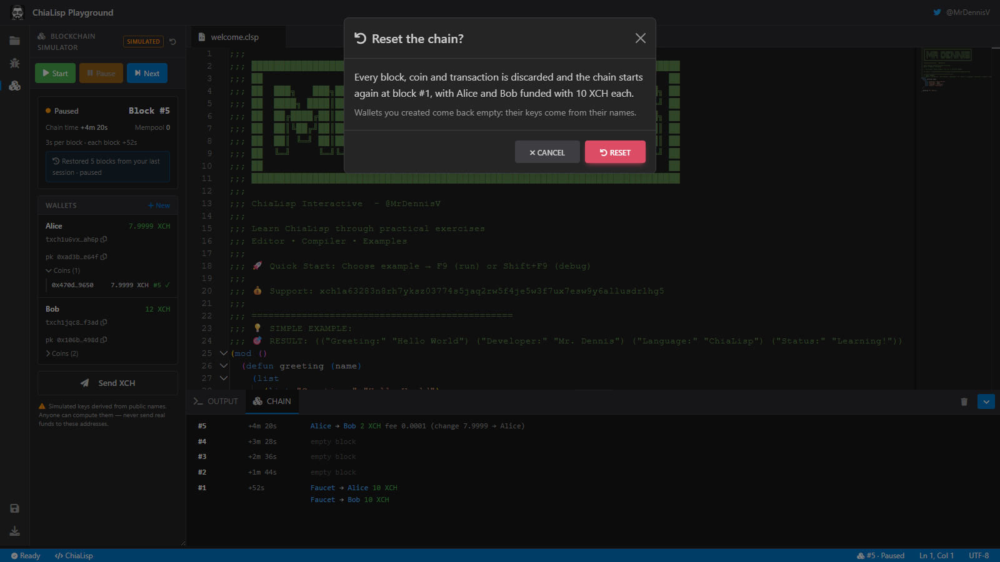
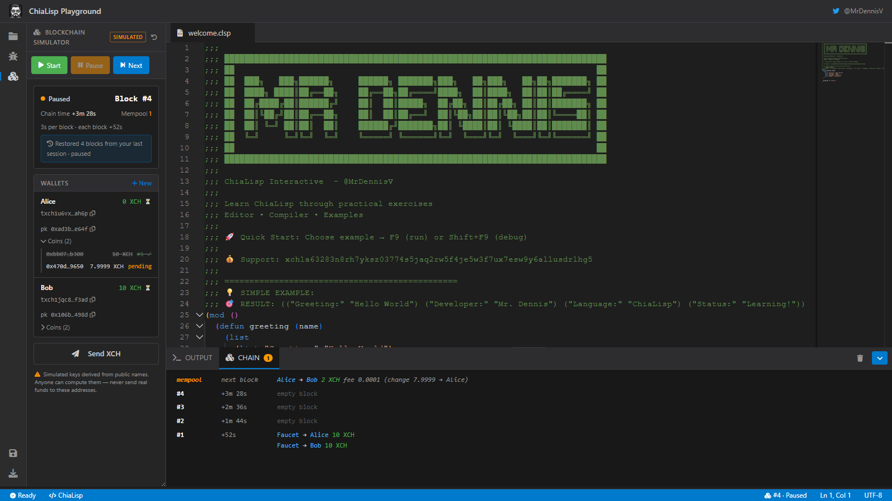

# Blockchain Simulator — Phase 1: Chain Controls, Wallets and Sends

## Goal

Today the playground **runs a puzzle** and prints the conditions it returns. That is not how Chia works: coins are locked by puzzles, spends are validated against chain state, and time and height matter. Phase 1 adds a local simulated blockchain to the playground, which the user can start, pause and step block by block, with wallets they control and XCH they can send. It is the base for Phase 2 (spending coins locked by the user's own puzzles and debugging spend bundles).

Success means a learner can, without leaving the browser:

- start a chain and watch blocks being farmed, then pause it and farm one block at a time;
- send XCH from a faucet or from a wallet to any address and see it wait in the mempool and confirm in the next block;
- see that a balance is a set of coins (spent inputs, the payment, change back, the fee);
- lock XCH in the puzzle open in the editor by sending to that puzzle's address;
- refresh the page and find the chain exactly where they left it.

## Scope

**In Phase 1**

- Chain controls: Start, Pause, Next (farm one block), Reset; current block height, chain time, mempool size.
- Mempool: transactions wait until the next block.
- Faucet: creates new coins at any address (simulator only).
- Wallets: Alice and Bob funded at genesis; the user creates and removes more; the user controls all of them.
- Send XCH from the faucet or a wallet, with coin selection, change and fee.
- "This puzzle" shortcut: the address of the program in the editor, with its curried parameters.
- Other addresses: non-wallet addresses that received XCH (e.g. a contract), with their coins.
- Block feed in the bottom panel.
- Persistence across page reloads.

**Not in Phase 1**

- Spending coins locked by the user's own puzzles, the spend bundle builder, the bundle inspector, "debug this spend" (Phase 2, designed separately). Phase 1 only has to leave room for it:
  - The chain log records, for every puzzle hash sent to through "this puzzle", the file, curried parameters and compiled program: the puzzle reveal Phase 2 needs to spend those coins.
  - Direction discussed so far: a single-coin "Spend…" action on contract coins, and a Bundle Builder for dependent spends, backed by a `.bundle.json` file next to the `.clsp` files, where spends reference each other (`$sender.coin_id`, `$sender.children[0]`).
  - Known issue for then: `examples/blockchain/announcements.clsp` asserts the bare message, but `ASSERT_COIN_ANNOUNCEMENT` expects `sha256(coin_id + message)`, so it will fail once spends are validated.
- Guided scenarios per example (Phase 3).
- Exporting or sharing a chain (the persisted action log makes it possible later).

## User interface

The feature lives inside the existing layout and reuses its components and theme tokens: a third activity-bar view next to Explorer and Run and Debug, a **CHAIN** tab next to OUTPUT in the bottom panel, a chain indicator in the status bar, and modals in the same style as "Execute Program". An interactive mockup was reviewed and approved; screenshots below.



### Chain view (sidebar)

- **Header:** "BLOCKCHAIN SIMULATOR", a `simulated` badge and a Reset icon (kept away from Start and Next so it isn't hit by accident).
- **Toolbar:** Start, Pause, Next, styled like Build, Debug and Run. Start is disabled while running; Pause is disabled while stopped or paused.
- **Status card:**
  - state (Stopped, Running with a pulsing dot, or Paused);
  - `Block #N`, which briefly highlights when it changes;
  - chain time since genesis;
  - mempool count;
  - "3s per block · each block +52s";
  - after a reload, a notice: "Restored N blocks from your last session · paused".
- **Wallets card:** one row per wallet:
  - name and confirmed balance (⏳ while it has pending coins);
  - short address and short public key, each with a copy button;
  - a collapsible **Coins (n)** list: each coin's id, amount, and confirmation block or `pending`; coins being spent are struck through;
  - on hover, ✈ (send from this wallet) and ✕ (remove from the panel);
  - **+ New** adds a wallet inline by name.
- **Send XCH** button, which opens the send modal.
- **Other addresses card** (shown only when non-empty): addresses that received XCH and aren't wallets. A puzzle address shows the file name and a `contract` tag. The ✕ on hover stops watching the address.
- **Warning:** "Simulated keys derived from public names. Anyone can compute them — never send real funds to these addresses."

### Send modal



- **From:** Faucet or any wallet. The hint under it says what signs the transaction ("Signed with Alice's key · 10 XCH confirmed", or that the faucet creates new coins).
- **To:** a `txch1…` or `xch1…` address, or a `0x` puzzle hash. Shortcut chips below it: every other wallet, plus the current editor file tagged "this puzzle".
- A pasted `xch1…` (mainnet) address is accepted and decoded to its puzzle hash, with a notice: "Mainnet address — nothing is sent on mainnet; the simulator only uses its puzzle hash (the same one as txch1…)". The same puzzle hash behind both prefixes is itself a lesson.
- **Amount** and **Fee** in XCH. The fee is disabled for the faucet. Default fee: 0.0001.
- **Live summary** of the transaction before it is sent:

  ```
  Spends 1 coin (10 XCH)
  → Bob 1.5 XCH
  → Alice 8.4999 XCH change
  → farmer 0.0001 XCH fee
  ```

- Validation errors appear inline, for example "Alice has 3 XCH confirmed; needs 5.0001", or an invalid address.

### Block feed (bottom panel, CHAIN tab)

Newest first. A `mempool / next block` row lists pending transactions. Each block row shows `#N`, its chain time and its transactions ("Alice → Bob 1.5 XCH fee 0.0001 (change 8.4999 → Alice)"), or "empty block". A newly farmed block flashes briefly. The tab shows an orange badge with the mempool count.

### Status bar

`⛓ #128 · Running` on the right. Clicking it opens the Chain view.

### Reset



Reset asks for confirmation in a modal. It discards every block, coin and transaction, and returns to genesis: block #1 with Alice and Bob funded with 10 XCH each. Wallets the user created come back with no coins.

### Restored session



## Behaviour

### Blocks, height and time

- The simulator forms a block only when a spend is submitted, and an empty spend bundle is rejected (`InvalidSpendBundle`). Each block therefore includes a **tick coin**: puzzle `1` (it returns its solution as conditions), which spends itself and recreates itself with one mojo. Verified: `ASSERT_HEIGHT_RELATIVE 3` fails at +1 and +2 and passes at exactly +3.
- Every block includes the tick spend plus every bundle in the mempool, all in one `spendCoins` call. Verified: independent bundles can be combined into one block.
- After each block the chain clock advances **52 s** (`passTime`), the average Chia transaction block time. `ASSERT_SECONDS_*` and `ASSERT_HEIGHT_*` then behave realistically.
- Running mode farms a block every **3 s** of real time. Pause stops the timer. Next farms exactly one block, whether paused or running.
- Height comes from `sim.height()`.

### Wallets and keys

- Keys are derived from the wallet name: `SecretKey.fromSeed(sha256("chialisp-playground:" + lowercase(name))).deriveSynthetic()`. The address is `txch` + bech32m of `standardPuzzleHash(syntheticPublicKey)`.
- The same name always gives the same keys, so Alice has the same address in every session, and examples can reference her public key.
- The user controls every wallet. When a wallet sends, the simulator signs with that wallet's synthetic secret key. Secret keys are never shown.
- **Removing** a wallet only hides it from the panel; its coins stay on chain. Creating a wallet with the same name brings it back with its coins. This is intentional: it teaches that funds live on chain and keys come from the name.
- Wallet names are unique, case-insensitive.

### Faucet

- Waits in the mempool like any transaction. When the next block is farmed, the coin is created with `sim.newCoin(puzzleHash, amount)`, so its created height is that block's height.
- No fee.

### Sending from a wallet

- Coins are selected largest-first from the wallet's confirmed, unspent, not-already-pending coins until they cover amount plus fee.
- The spend is a standard spend (`Clvm.spendStandardCoin` with a delegated spend) with one `CREATE_COIN` to the destination, one `CREATE_COIN` of the change back to the sender (if any) and one `RESERVE_FEE` for the fee.
- Selected coins are marked pending-spend immediately, so they can't be selected twice. The payment and the change show as `pending` until the block confirms them.
- Sending to your own address is rejected with a message.

### "This puzzle"

- The shortcut compiles the program in the active editor tab, applies the curried parameters saved for that file (the same ones the Run modal uses), and uses the tree hash as the destination. The address is encoded with `txch`.
- The destination then appears under Other addresses with the file name and a `contract` tag. Spending it is Phase 2.
- If the program doesn't compile, the chip is disabled and its tooltip shows the compile error.

### Coin tracking

- `sim.coinState(id)` provides created and spent heights, and `sim.children(id)` provides the coins a spend created.
- The playground keeps a small index from puzzle hash to coin ids, filled whenever it creates a coin: faucet, payment, change and tick. That index answers "which coins belong to this address"; the simulator stays the source of truth for their state.

## Architecture

### Wallet SDK

- Use the official `chia-wallet-sdk-wasm` **0.36.0** (Apache-2.0, xch-dev), vendored under `js/vendor/chia-wallet-sdk/`.
  - It exposes `height()`, `coinState()`, `children()`, `coinSpend()` and `withSeed()`, which the copy vendored in chia-gaming-connect lacks.
- The package is built for bundlers: it imports the `.wasm` as a module. The playground has no bundler, so `WasmLoader` instantiates it manually:
  - `WebAssembly.instantiateStreaming(fetch(wasm), { './chia_wallet_sdk_wasm_bg.js': bg })`, then `bg.__wbg_set_wasm(instance.exports)`;
  - in Node, `WebAssembly.instantiate` with the file read from disk.
  - Verified in Node against 0.36.0.
- The `.wasm` is 6.5 MB. It is **loaded only the first time the Chain view is opened**. The nginx config adds `application/wasm` to `gzip_types`.

### Modules

Each module has one responsibility, and collaborators are passed in through the constructor.

| Module | Responsibility |
|---|---|
| `WasmLoader` (extended) | Loads `clvm_tools` (as today) and the wallet SDK, in the browser or in Node. |
| `ChainService` | Owns the `Simulator`: the tick coin, farming blocks, the mempool, height and time, running/paused, reset. Emits `block`, `mempool` and `state` events. It knows nothing about the DOM. |
| `WalletService` | Wallet keys and addresses from names, balances, coin selection, and building faucet and standard-spend transactions for `ChainService`. Tracks hidden wallets. |
| `ChainLog` | The append-only action log (see Persistence) and the replay of that log into a fresh `ChainService`. |
| `ChainPersistence` | Stores the log. `BrowserChainPersistence` uses IndexedDB; `MemoryChainPersistence` is for tests. |
| `ChainView` | Renders the sidebar view, the CHAIN tab, the status bar item and the modals from service events. It only calls service methods; it holds no chain logic. |

The WASM `Simulator` object never leaves `ChainService`. The UI and the log see plain data only: hex strings, bigint amounts, names.

### Persistence

The simulator exposes no way to serialize its state. `clone()` shares state instead of copying it, and `insertCoin()` can't restore creation heights or timestamps, so a snapshot would silently break relative time locks. Instead, the playground persists **what happened** and replays it:

- **The action log** is an ordered list of entries:
  - `genesis`;
  - `wallet-created {name}` and `wallet-hidden {name}`;
  - `watch-removed {address}`;
  - `faucet {puzzleHash, amount}`;
  - `send {coinSpends (hex), signerNames}`;
  - `blocks {count}`: farm `count` blocks, each including whatever the mempool holds at that point. Consecutive farms merge into one entry, so a chain left running stays small.

  Sends store the exact serialized coin spends, so replay doesn't depend on the coin-selection code staying identical.
- **Replay** creates a new simulator and re-applies the log in order. Verified:
  - replaying the same history yields identical coin ids;
  - 5,000 blocks replay in about 124 ms (0.02 ms per block); an hour of running (1,200 blocks) takes about 30 ms.
- **After a reload** the chain is restored **paused**, and pending mempool transactions are restored as pending.
- **Storage follows the pattern used in chia-gaming-connect (`Database.persist` / `BrowserPersistence`):**
  - IndexedDB, not `localStorage`, so writes never block the main thread;
  - **coalesced writes:** saves requested in the same tick share one write, and a save requested while a write is in flight chains exactly one follow-up;
  - `durability: 'strict'` transactions;
  - a **generation counter** written in the same transaction. If another tab committed since this tab loaded, the write is rejected; this tab stops producing blocks and shows "This chain changed in another tab — reload to continue". Last-writer-wins is never allowed to silently discard a chain.
  - a best-effort save on `pagehide`.
- UI preferences are stored in the same record: hidden wallets, removed watched addresses, expanded coin lists and the last selected view.

### Error handling

- **The SDK fails to load:** the Chain view shows the error and a Retry button. The rest of the playground is unaffected.
- **Replay fails** (e.g. a future SDK changes validation): the view says the saved chain can't be restored and offers **Reset** or **Download saved log**. The stored log is never deleted automatically.
- **Storage is unavailable** (private mode, quota): the chain keeps working in memory, with a one-line notice that it won't survive a reload.
- **A block is rejected by the simulator:** this can't happen from Phase 1 UI actions, because faucet and standard spends are built by the playground. If it does, the offending transaction is dropped from the mempool with the simulator's error shown in the feed, and the block is farmed without it.

## Testing

Everything below runs in `npm test` (Node, no browser), loading the real SDK through `WasmLoader` and using `MemoryChainPersistence`. No simulator or service is mocked.

- **Height:** Next increments the height by exactly one. A coin with `ASSERT_HEIGHT_RELATIVE n` is rejected before `n` blocks and accepted at `n`.
- **Time:** each block advances 52 s. A coin with `ASSERT_SECONDS_RELATIVE 104` needs two blocks.
- **Mempool:** a faucet send is pending until the next block, then confirmed at that height. Several sends in the mempool confirm in the same block.
- **Wallets:** Alice's address is identical across two fresh chains. A send spends the selected coins and creates the payment, the change and the fee exactly. Overspending and sending to yourself are rejected with their messages. A coin already pending can't be selected twice.
- **Remove and restore:** hiding a wallet and re-creating it by name restores it with its coins.
- **Reset:** returns to block #1 with only the genesis coins.
- **Persistence:**
  - replaying a saved log reproduces the same height, time, coin ids, balances and pending mempool;
  - ten saves in one tick produce one write;
  - a generation conflict rejects the write and puts the chain in the "changed in another tab" state.
- **"This puzzle":** the address equals `txch` + bech32m of the curried program's tree hash.

Each test must be seen to fail against a broken implementation before it is accepted, e.g. skip the `passTime`, farm without the tick, or drop the change output.

## Decisions

- **Mainnet addresses (decided):** the playground only ever *displays* `txch` addresses, because its keys are derived from public names and funds sent to them on a real network could be taken by anyone. Pasted `xch1…` input is accepted with the notice described under Send modal.
- **UI end-to-end tests (decided):** Playwright tests drive the Chain view as a user does (Start, Send, Next, reload and restore, Reset) under a separate `npm run test:ui`. Playwright is a dev dependency used only there; `npm test` stays dependency-free and browser-free.
